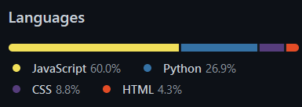

fichier en format markdown, visible [ici](https://markdownlivepreview.com/).

# Pertience

### Documentation
Il a été utilisé la **docstring** javascript pour la doctumentation des fonctions.
Par convention et habitude, les commentaires ont été fait en anglais (approximatif). Toute l'interface utilisateur est en français.

### Source
Code entièrement fait main, dans le cadre de l’enseignement.
En cas de doute, cela est vérifiable [ici](https://github.com/AKtomik/tWOWOrds/commits/main/).
(Travail effectué sur github).

# Projet

### Fonctionnalités
Objectif : trouver 3 lettres de telle façon que les 6 premières lettres et les 6 dernières forment un mot.
Le projet a pour but de proposer la meilleure fluiditée pour l'utilisateur.
Le jeu fonctionne pour tout dictionnaire donné, totalement interchangable.

### Fonctionnement
Pour avoir les meilleurs performances possibles, Le jeu fonctionne sur un principe de pré-calculs.
Il faut donc en amount effecuter la comilation du dictionnaire avec [compiler.py](compiler.py)
Cette compilation se fait en plusieurs étapes. Sélectionner l'option 1 pour effectuer tous les étapes.
Cela peut prendre de 60s à 300s (dépendant des performances de l'ordinateur).
La partie web est elle, basée sur du javascript.
L'algorithme de recherche binaire est utilisé pour gagner 1 à 2ms par proposition.

### Serveur
Avec la restriction [CROS](https://developer.mozilla.org/en-US/docs/Web/HTTP/CORS/Errors/CORSRequestNotHttp), le fichier ne peut être ouvert localement.
Pour correctement ouvrir la page, il est nécessaire de l'exécuter à partir
d'un serveur local ou distant (SimpleHTTPServer, apache).
Néenmoins, il serais totalement envisagable de contourner cette restriction à l'avenir.

# Fun facts
voici quelques informations intéressantes concernant le dictionnaire donné :

- Dictionnaire de 17319 mots.
- Comporte 104155 problèmes. (énorme)
- Chaque problème a, en moyenne, 1,33 solution.s. 
- la solution la plus présente, ENT, résout 8% des problèmes. 
- Le problème avec le plus de solution est [COU[__]TES], avec 19 solutions.

Mais d'autres dictionnaires pourraient être utilisés, avec donc des capacités toutes autres !
